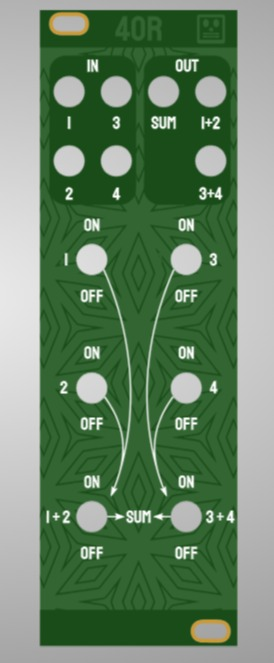
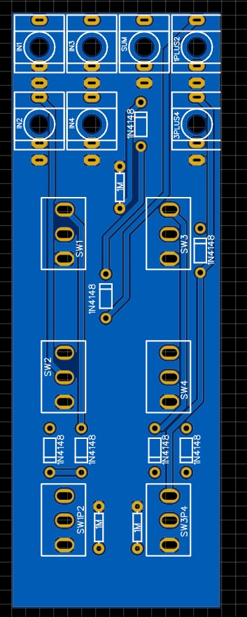

# 4OR
4x logical OR combiner - Passive 8HP Eurorack Module - Designed by Krach der Roboter

This module was commissioned by Krach der Roboter as a passive performance tool/utility helper.
It is basically 4 inputs that you can use to combine logical signals. Using diodes, the outputs function as logical sums (or OR combiners) of the
input signals. It is meant to be as easy as possible to serve as an entry-level kit for building during trade fairs, workshops etc.

## STATUS: PCB NOT VERIFIED - We have a working stripboard version but the PCB will take some time to verify

## Hardware
  

The "gerbers" folder contains the files for the PCB and the panel. You can order it from any PCB maker, we use JLC. Since there is no exposed copper on the panel, you can order it in any material/color combination that suits you.
Switches are 2-toggle ON/ON switches (without the middle position). Most other components are standard and should be trivial to source.

Have fun building :)

